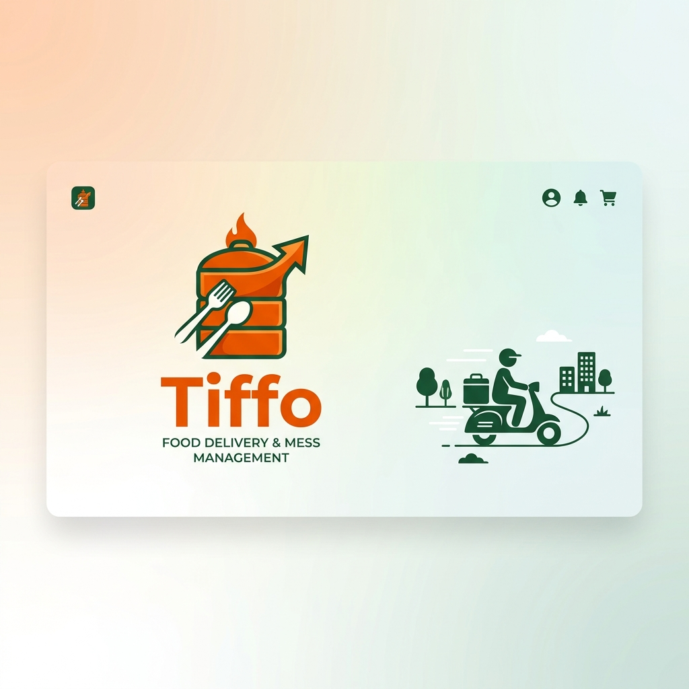
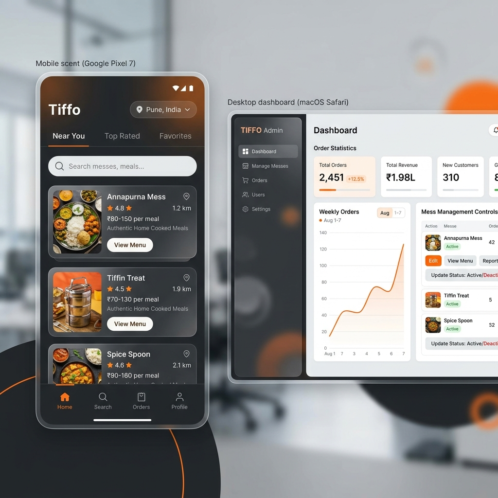

# 🍱 Tiffo - The Ultimate Mess Management Platform

[](https://reactjs.org/)
[](https://vitejs.dev/)
[](https://firebase.google.com/)
[](https://leafletjs.com/)
[](https://vercel.com/)



## 🌟 Overview

**Tiffo** is a modern, high-performance web application designed to bridge the gap between hungry customers and local mess (tiffin) providers. Built with a focus on seamless user experience and robust management tools, Tiffo empowers mess owners to digitize their operations while providing customers with a reliable platform to discover, subscribe, and enjoy home-cooked meals.

---

## ✨ Key Features

### 👨‍👩‍👧‍👦 For Customers
- **🔍 Smart Discovery**: Find the best messes near you using our interactive map-based search powered by Leaflet.
- **📋 Detailed Menus**: Explore daily menus, pricing plans (daily, weekly, monthly), and mess specialties.
- **⚡ Quick Onboarding**: Smooth registration and profile setup to start ordering in minutes.
- **📦 Order Tracking**: Keep track of your current and past tiffin orders with a dedicated customer portal.

### 👨‍🍳 For Mess Owners
- **📊 Business Dashboard**: A comprehensive overview of your sales, active subscriptions, and customer growth.
- **🛠️ Mess Management**: Full control over your mess profile, including menu updates, pricing, and operating hours.
- **📈 Registration Portal**: Simple, step-by-step process to get your mess listed and verified on the platform.
- **🔐 Secure Access**: Role-based authentication ensuring your business data stays protected.

---

## 📸 Screenshots



---

## 🛠️ Tech Stack

- **Frontend**: [React 19](https://react.dev/) - Utilizing the latest Concurrent Mode and Suspense features.
- **Bundler**: [Vite 7](https://vite.dev/) - Lightning-fast development and optimized production builds.
- **Backend/Auth**: [Firebase](https://firebase.google.com/) - Real-time database and secure user authentication.
- **Mapping**: [Leaflet](https://leafletjs.com/) & [React-Leaflet](https://react-leaflet.js.org/) - Interactive maps for mess location discovery.
- **Routing**: [React Router 7](https://reactrouter.com/) - Modern navigation with nested layouts and protected routes.
- **Styling**: Vanilla CSS with modern variables and glassmorphism design principles.

---

## 🚀 Getting Started

### Prerequisites
- Node.js (Latest LTS recommended)
- npm or yarn

### Installation

1. **Clone the repository**
   ```bash
   git clone https://github.com/Mr-Ritesh-t/Tiffo.git
   cd Tiffo
   ```

2. **Install dependencies**
   ```bash
   npm install
   ```

3. **Set up Environment Variables**
   Create a `.env` file in the root directory and add your Firebase configuration:
   ```env
   VITE_FIREBASE_API_KEY=your_api_key
   VITE_FIREBASE_AUTH_DOMAIN=your_auth_domain
   VITE_FIREBASE_PROJECT_ID=your_project_id
   VITE_FIREBASE_STORAGE_BUCKET=your_storage_bucket
   VITE_FIREBASE_MESSAGING_SENDER_ID=your_messaging_sender_id
   VITE_FIREBASE_APP_ID=your_app_id
   ```

4. **Run development server**
   ```bash
   npm run dev
   ```

---

## 📂 Project Structure

```text
src/
├── app/          # Global providers (Auth, etc.)
├── components/   # Reusable UI components
├── constants/    # Route paths and app constants
├── guards/       # Route protection logic
├── hooks/        # Custom React hooks
├── layout/       # Page layouts (Sidebar, Navbar)
├── pages/        # Main application screens
├── services/     # API and Firebase integration
└── types/        # Type definitions
```

---

## 📄 License

This project is licensed under the MIT License - see the [LICENSE](LICENSE) file for details.

---

## 🤝 Contact

**Ritesh Tayade**
- GitHub: [@Mr-Ritesh-t](https://github.com/Mr-Ritesh-t)
- Project Link: [https://github.com/Mr-Ritesh-t/Tiffo](https://github.com/Mr-Ritesh-t/Tiffo)

Developed with ❤️ for the food community.
